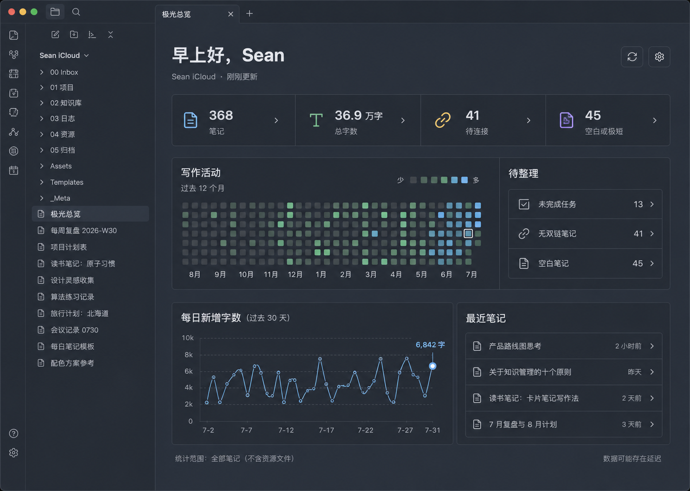

# Aurora Dashboard

A calm, zero-config home dashboard for Obsidian. Aurora Dashboard turns the
current vault into a clickable overview of writing activity, note health,
unfinished work, recent notes, and top-level folders.

The interface is written in Chinese and uses a Nord-inspired visual language.
All analysis runs locally inside Obsidian.



## What it shows

- Total Markdown notes and total readable word count.
- Notes with no resolved backlinks.
- Empty or very short notes, with a configurable word threshold.
- Open Markdown task items.
- A 365-day writing activity heatmap.
- A 30-day added-word trend.
- Recently modified notes.
- Note and word totals for each top-level folder.
- Clickable details for every headline metric, issue, date, and folder.

Aurora Dashboard opens automatically when the workspace is ready. You can
choose whether it replaces the active tab or opens in a new tab.

## Metric definitions

| Metric | Definition |
| --- | --- |
| Notes | Included `.md` files in the current vault. |
| Total words | Readable CJK characters plus non-CJK word groups after common Markdown syntax, frontmatter, code fences, and comments are removed. |
| No backlinks | Included notes that are not targeted by any resolved link in Obsidian's metadata cache. |
| Empty or very short | Notes whose readable word count is at or below the configured threshold. The default is 10. |
| Open tasks | Unchecked Markdown task items matching `- [ ]`. |
| Added words | Positive word-count deltas observed after the plugin starts tracking. Deletions do not reduce a day's total. |

Obsidian files do not contain an exact historical “words added per day” ledger.
For dates before installation, Aurora Dashboard can estimate activity by
grouping each note's current word count under its last-modified date. Estimated
cells use a dashed outline and can be disabled in settings.

## Privacy and safety

- No analytics, network calls, accounts, or cloud service.
- Statistics and activity history stay in
  `.obsidian/plugins/aurora-dashboard/data.json`.
- The plugin reads note content for local counting but never edits note files.
- Excluded folders and their descendants are omitted from every metric.

## Install

### Manual installation

1. Create `.obsidian/plugins/aurora-dashboard/` inside your vault.
2. Copy `main.js`, `manifest.json`, and `styles.css` into that folder.
3. Reload Obsidian.
4. Enable **Aurora Dashboard** under **Settings → Community plugins**.

### Community plugin directory

After the plugin is accepted into the Obsidian Community plugin directory, it
can be installed from **Settings → Community plugins → Browse**.

## Commands

- **Aurora Dashboard: 打开首页看板**
- **Aurora Dashboard: 重新扫描首页统计**

The ribbon dashboard icon also opens the view.

## Settings

- Optional greeting name.
- Open on startup.
- Replace the active tab or open a new tab.
- Empty/short-note threshold.
- Excluded folders.
- Show or hide estimated pre-install history.
- Activity calendar range: 90, 180, or 365 days.

## Development

Requirements: Node.js 22 and npm.

```bash
npm install
npm run dev
```

Run the complete verification suite:

```bash
npm run check
```

This runs ESLint, Vitest, TypeScript type-checking, and the production esbuild
bundle.

## Release

1. Update `manifest.json`, `package.json`, `versions.json`, and
   `CHANGELOG.md`.
2. Run `npm run check`.
3. Commit the source and metadata changes. `main.js` is generated during the
   release workflow and is intentionally ignored by Git.
4. Push a Git tag exactly equal to the manifest version, without a `v` prefix.
5. The included GitHub Action publishes `main.js`, `manifest.json`, and
   `styles.css` as release assets.
6. Submit the repository through the
   [Obsidian Community plugin submission process](https://docs.obsidian.md/Plugins/Releasing/Submit+your+plugin).

Repository: [tianxiangyu0717-hub/obsidian-aurora-dashboard](https://github.com/tianxiangyu0717-hub/obsidian-aurora-dashboard)

## Compatibility

`minAppVersion` is `1.8.7`. The plugin does not use Node or Electron APIs and
includes narrow-view responsive styles. Hands-on QA currently covers Obsidian
1.13.4 on macOS.

## Design reference

The color system and restrained dark surfaces are inspired by
[insanum/obsidian_nord](https://github.com/insanum/obsidian_nord). Aurora
Dashboard is an independent plugin and does not include code or assets from
that theme.

## License

[MIT](LICENSE)
